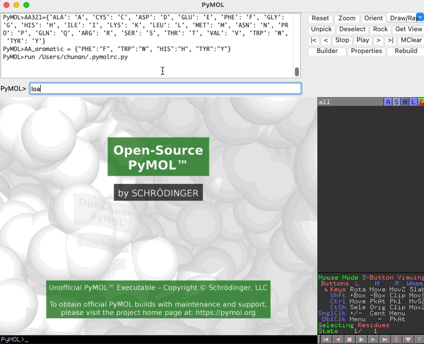

# Visualize chain contacts in PyMOL

This script is used to visualize chain contacts in PyMOL.

## Example



## Dependnecies

### Install PyMOL

On Mac or Linux machine, you can install PyMOL using conda:

```bash
# create a new environment if needed
conda create -n pymol python=3.12
conda activate pymol
# install PyMOL
conda install -c conda-forge pymol-open-source
# set alias in your shell configuration file
echo "alias pymol='$(which pymol)'" >> ~/.bashrc
```

### Install dependencies

```bash
conda activate pymol
pip install -r requirements.txt
```

### Install the plugin in PyMOL

Go to tab `Plugin` -> `Plugin Manager` -> `Install New Plugin` -> Under `Install from local file` click `Choose file ...` and select the script `cal_chain_dist_pymol.py`.

## Usage

### PyMOL CLI

```pymol cli
cl_select_interface 1a14, N, HL, dist_cutoff=4.5, save_results=True
```

- `1a14`: `object_name`, can be any selection expression, e.g. use `all` to select all objects.
- `N`: `chain_label_set_1`, can be single or multiple chain labels.
  - For multiple chains, use e.g. `ABC`.
  - Accept `*` to select all chains.
  - By default, if not provided, will use all chain labels in the object.
- `HL`: `chain_label_set_2`, can be single or multiple chain labels.
  - For multiple chains, use e.g. `ABC`.
  - Accept `*` to select all chains.
  - By default, if not provided, will use all chain labels in the object.
- `dist_cutoff`: distance cutoff to define contacts
- `save_results`: save the results to files, including `<object_name>_contacts.csv` and `<object_name>_interface_residues.txt`
  - `<object_name>_contacts.csv`: a table of `residue_1`, `residue_2`, `distance`, `chain_1`, `chain_2`, `interaction`
  - `<object_name>_interface_residues.txt`: a text file mapping chain labels to interface residues

Example output files are provided under `example` folder.

In this example, this function is identifying any contacts between chain `N` and chain `H` and `L` in object `1a14` with a distance cutoff of 4.5 Å, and save results to `1a14_contacts.csv` and `1a14_interface_residues.txt`.

NOTE: this function only detects contacts between the chains provided in `chain_label_set_1` and `chain_label_set_2`. If you want to detect contacts between all chains, you can use `*` as the chain label set.
